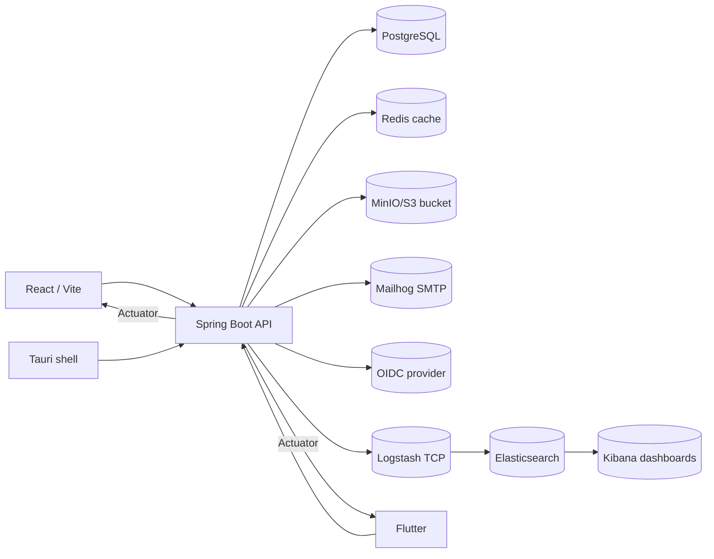
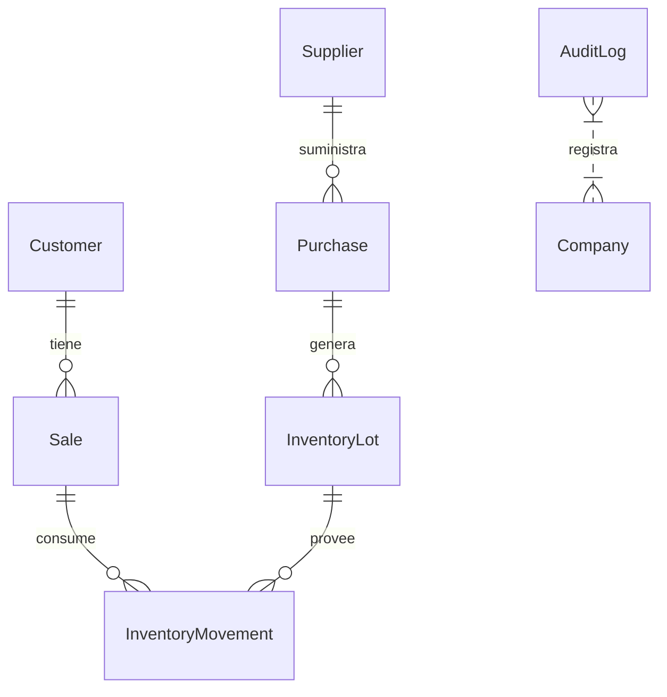

# Auditoría integral del proyecto PyMERP

## 1. Resumen ejecutivo
- El monorepo orquesta una API backend multitenant (Spring Boot/Gradle), la UI React/Vite, un cliente Flutter y un empaquetado Tauri para escritorio (`README.md:1-58`).
- Los dominios cubren ventas, compras, inventario, clientes, proveedores y facturación con cache Redis, autenticación JWT/OIDC y auditoría persistida en base de datos (`README.md:17-34`).

### Estado de salud (semáforo)
| Componente | Semáforo | Observaciones |
|---|---|---|
| Backend API | 🟡 | Seguridad y multitenancy robustas pero dependientes de secretos configurados manualmente (`backend/src/main/java/com/datakomerz/pymes/config/SecurityConfig.java:47-140`, `backend/src/main/resources/application.yml:37-98`, `backend/src/main/java/com/datakomerz/pymes/config/SecretsValidator.java:1-64`). |
| Frontend React | 🟢 | Usa React Query, React Router y refresco automático de sesión (`ui/package.json:1-50`, `ui/src/context/AuthContext.tsx:1-147`). |
| Cliente Flutter | 🟡 | Solo se ejecutan pruebas en el job de contingencia (`.github/workflows/contingency-ci.yml:1-35`); no hay paso regular en `ci.yml`. |
| Desktop Tauri | 🟡 | Sólo se genera MSI desde `main` y requiere llaves de firma (`.github/workflows/desktop.yml:1-46`). |

### Principales riesgos
1. En desarrollo y despliegues locales siguen activos secretos por defecto (JWT, facturación, storage) que pasan la validación automática (`backend/src/main/resources/application.yml:37-98`, `.env:1-24`, `backend/src/main/java/com/datakomerz/pymes/config/SecretsValidator.java:1-64`); hay que asegurar rotación/gestión centralizada para producción.
2. La instrumentación distribuida se limita a trazas manuales en `RefreshTokenUseCase` (`backend/src/main/java/com/datakomerz/pymes/auth/application/RefreshTokenUseCase.java:1-107`), mientras que no hay exportadores OTLP ni integración con OpenTelemetry más allá de la API que se trae en Gradle (`backend/build.gradle:20-66`).
3. El pipeline principal (`.github/workflows/ci.yml:13-120`) descubre código y corre pruebas backend, pero no ejecuta `npm run test` ni `flutter test`, dejando la UI y la app móvil sin verificación automática.
## 2. Mapa del repositorio
- `backend/` concentra la API Spring Boot, las entidades (por ejemplo `com.datakomerz.pymes.customers`, `sales`, `billing`, `inventory`, `multitenancy`), las migraciones Flyway (`backend/src/main/resources/db/migration/V1__*.sql`…`V37__*.sql`) y la configuración (`application*.yml`, `logback-spring.xml`).
- `ui/` alberga la SPA React/Vite con `AuthContext`, hooks, servicios (`ui/src/services/client.ts`), y scripts de lint/test/format definidos en `ui/package.json:1-50`.
- `app_flutter/` contiene el cliente móvil con Riverpod, `modules/` por dominio y la configuración de dependencias (`app_flutter/pubspec.yaml:1-41`).
- `desktop/` y `desktop/src-tauri/tauri.conf.json` envuelven la UI en un binario Tauri/Windows, mientras que `docs/windows-desktop.md` documenta el empaquetado (`README.md:40-42`).
- Infraestructuras: `docker-compose.yml` orquesta backend, Postgres, Redis, frontend, MinIO y Mailhog (`docker-compose.yml:3-106`), `docker-compose.local-prod.yml` suma nginx y constrains de secrets, `docker-compose.elk.yml` levanta Elasticsearch/Logstash/Kibana (`logstash/` y `kibana/dashboards/README.md:1-120`).
- `scripts/` ofrece utilidades de despliegue, migraciones y tests (`scripts/flyway-migrate.*`, `scripts/test-protected.ps1`), y `.github/workflows/` define la CI/CD principal, contigencia, despliegue y build desktop (`.github/workflows/*.yml`).

```text
backend/
├ src/main/java/com/datakomerz/pymes/{auth,customers,sales,purchases,inventory,billing,common,config,multitenancy}
├ src/main/resources/{application*.yml,logback-spring.xml,db/migration,templates}
├ build.gradle / gradle-wrapper
├ storage/ (artifacts locales)

ui/
├ package.json
├ tsconfig/vite.config.ts
├ src/{components,context,services}

app_flutter/
├ lib/{modules,core,domain}
├ pubspec.yaml

desktop/
├ package.json
└ src-tauri/{tauri.conf.json,src}

docs/, nginx/, logstash/, kibana/, scripts/
```

- Archivos residuales que deben revisarse: `temp.txt`, `temp_script.ps1`, `temp_segment.txt` están en la raíz sin explicación aparente y pueden confundirse con artefactos temporales.
- Generados (no tracked pero presentes en workspace): `node_modules/`, `backend/build/`, `app_flutter/build/`, `desktop/src-tauri/target/`.
## 3. Arquitectura y diseño
- El stack está organizado en bounded contexts (`auth`, `customers`, `sales`, `billing`, `inventory`, etc.) que exponen controladores REST y casos de uso en `application`/`dto` para mantener una separación de responsabilidades (`backend/build.gradle:82-110`).
- La multitenancy se garantiza en dos capas: el filtro HTTP `TenantInterceptor` carga `X-Company-Id` antes de cada request (`backend/src/main/java/com/datakomerz/pymes/multitenancy/TenantInterceptor.java:1-90`), mientras que `TenantFilterAspect`/`TenantValidationAspect` activan el filtro Hibernate y validan acceso cruzado (`backend/src/main/java/com/datakomerz/pymes/multitenancy/TenantFilterAspect.java`, `TenantValidationAspect.java`).
- La auditoría y observabilidad usan `LoggingContextFilter` (MDC + X-Trace-ID) y `AuditInterceptor` (anotaciones `@Audited`) antes de persistir logs en `audit_logs` (`backend/src/main/java/com/datakomerz/pymes/config/LoggingContextFilter.java:1-76`, `backend/src/main/java/com/datakomerz/pymes/audit/AuditInterceptor.java:1-200`).



- `DevServerPortCustomizer` permite que el backend encuentre un puerto libre cuando 8081 está ocupado (`backend/src/main/java/com/datakomerz/pymes/config/DevServerPortCustomizer.java:1-69`).
- Las decisiones arquitectónicas claves están implícitas en `AppProperties` (cors, seguridad, captchas), `RedisCacheConfig`/`CacheMetricsConfig` y la validación de secretos (`backend/src/main/java/com/datakomerz/pymes/config/AppProperties.java:1-142`, `RedisCacheConfig.java:1-65`, `CacheMetricsConfig.java:1-65`, `SecretsValidator.java:1-64`).
## 4. Dependencias y build
| Nivel | Gestor | Notas clave |
|---|---|---|
| Backend (Java) | Gradle (`backend/build.gradle:3-110`) | Spring Boot 3.3.3, Flyway, Redis, JWT, SpringDoc (OpenAPI) y Logstash encoder; `checkstyle`/`spotless` se ejecutan en CI aunque están marcados `continue-on-error` (`.github/workflows/ci.yml:65-74`). |
| Frontend | npm/Vite (`ui/package.json:1-50`) | React 18, React Query, Axios, React Router y Vitest; la dependencia `@tanstack/react-query` es reciente, por lo que conviene fijar actualizaciones y correr `npm audit` localmente. |
| Cliente Flutter | Flutter (`app_flutter/pubspec.yaml:1-41`) | Dio/Riverpod/GoRouter + acceso a `geolocator` y `flutter_secure_storage`; hay plantillas para web/printing. |

- El `ci` workflow todavía no ejecuta `npm run test` ni `flutter test`, aunque el job de contingencia lo hace para `main/develop` (`.github/workflows/contingency-ci.yml:1-35`). Esto deja la calidad de UI/móvil fuera de la guardia el resto del tiempo.
- El trabajo `security-scan` lanza Trivy sobre el árbol `backend` (`.github/workflows/ci.yml:100-122`), pero no cubre dependencias de `ui` ni `app_flutter`.
- Se recomienda registrar controles adicionales para `npm audit`/`flutter pub outdated` y posiblemente integrar dependabot/bill-of-materials al pipeline.
## 5. API y endpoints
| Método | Ruta | Descripción | Handler | Auth | 2xx | 4xx/5xx | Notas |
|---|---|---|---|---|---|---|---|
| `POST` | `/api/v1/auth/login` | Autenticación JWT + refresh token (`AuthController.login`) | `com.datakomerz.pymes.auth.api.AuthController` | pública | 200 | 401 | Refresh token dual en `/api/v1/auth/refresh` acepta header `X-Refresh-Token` o cookie (`AuthController.java:17-37`). |
| `GET` | `/api/v1/customers` | Lista paginada con filtros q/segmento/activo y endpoints auxiliares para segmentos, stats, ventas, export/import CSV (`CustomerController.java:63-220`). | `CustomerController` | roles ERP/SETTINGS/ADMIN | 200 | 400/401/403 | Exporta CSV y permite importación mediante Multipart para administradores (`CustomerController.java:121-220`). |
| `POST` | `/api/v1/inventory/adjustments` | Ajustes manuales + alertas, resumen, movimientos y análisis ABC/forecast (`InventoryController.java:41-128`). | `InventoryController` | ERP/ADMIN | 200 | 400/403 | `movements` y KPIs devuelven `Page` con parámetros `page/size`; `forecast` acepta `productId` y `days`. |
| `POST` | `/api/v1/billing/invoices` | Emisión de factura fiscal con idempotencia (`BillingController.java:23-87`). | `BillingController` | ERP/ADMIN | 201 | 400/500 | Requiere encabezado `Idempotency-Key`; valida que payload `idempotencyKey` coincida y lanza 500 si no se obtiene documento fiscal (`BillingController.java:40-85`). |
| `GET` | `/api/v1/audit/logs` | Paginación de audit logs filtrados por tenant y usuario; audit logs capturados por `AuditInterceptor` (`AuditLogController.java:18-158`). | `AuditLogController` | ADMIN | 200 | 403/500 | Existen rutas auxiliares para acción, usuario, fallas y rango (`AuditLogController.java:28-158`). |

- Todos los listados manejan paginación/ordenación con `PageRequest` y `@RequestParam` (`CustomerController.java:63-120`, `InventoryController.java:71-120`).
- La API está documentada por SpringDoc/Swagger (`backend/build.gradle:38-40`), lo que permite exponer `/swagger-ui/index.html` en producción (`.github/workflows/deploy.yml:134-142` usa esta ruta para smoke tests).
## 6. Integraciones externas
| Servicio | Qué hace | Configuración relevante | Resiliencia y seguridad |
|---|---|---|---|
| PostgreSQL 16 | Persistencia relacional multitenant | `docker-compose.yml:32-48` y `application*.yml` exponen usuario `pymes`, migraciones Flyway de `db/migration` hasta `V37__*`. | Requiere aplicar `./gradlew flywayMigrate` antes de servir (`README.md:65-69`). |
| Redis 7 | Cache de productos/clientes/proveedores (`RedisCacheConfig.java:1-65`) y métricas (`CacheMetricsConfig.java:1-65`). | TTL por caché (5–60 min). Health check en `docker-compose.yml:50-60`. | `CacheMetricsRegistrar` expone `cache.size`, se diseña para invalidar entradas con prefijos de tenant. |
| MinIO/Storage S3 | Archivos de productos/compras (`storage/StorageService`). | Variables `STORAGE_S3_*` en `application.yml:89-95`, CLI local en `docker-compose.yml:80-93`. | Se sugiere reforzar rotación de credenciales y cifrado en tránsito. |
| Mailhog (SMTP) | Notificaciones de solicitudes/alerts | Configura `spring.mail` (`application.yml:25-35`) y se expone en `docker-compose.yml:94-100`. | Salud simple; no se usa en producción. |
| Keycloak/OIDC | Opcional para roles basados en token (`SecurityConfig.java:47-140`). | `.env:1-16` provee `KEYCLOAK_*` para desarrollo. | `JwtService` exige secreto ≥32 caracteres (`JwtService.java:1-69`). |
| Billing webhooks | Recibe estado de facturas (`/webhooks/billing`). | Firma HMAC en `BillingWebhookSignatureVerifier.java:1-120` y secreto en `billing.webhook.secret` (`application.yml:37-44`). Tolera 5 minutos de skew. | Validación de cabeceras, comparación en tiempo constante y tolerancia configurable. |
| ELK | Logstash consume JSON (`logstash/pipeline/logstash.conf:1-67`), envía a Elasticsearch (`docker-compose.elk.yml:1-40`), dashboards guiados en `kibana/dashboards/README.md:1-120`. | Logs enriquecidos con MDC de `LoggingContextFilter`. |
| DigitalOcean App Platform | Lugar de despliegue prod (`.github/workflows/deploy.yml:13-152`). | `doctl` construye y sube contenedor `REGISTRY/pymerp/backend`; health checks combinan `actuator/health/info` y `swagger-ui.html`. | Rollback automático si falla, notificaciones en Slack. |

- La facturación offline usa `BillingOfflineProperties` con reintentos y backoff (`backend/src/main/java/com/datakomerz/pymes/billing/config/BillingOfflineProperties.java:1-60`), lo que protege ante SII caído.
## 7. Modelo de datos y persistencia
- `Customer`, `Sale`, `Purchase`, `InventoryLot`, `InventoryMovement` y `AuditLog` son entidades `@TenantFiltered`/`@Auditable` que heredan de `TenantAwareEntity` para aplicar automáticamente `company_id` y auditoría (`backend/src/main/java/com/datakomerz/pymes/customers/Customer.java:1-146`, `backend/src/main/java/com/datakomerz/pymes/sales/Sale.java:1-65`, `backend/src/main/java/com/datakomerz/pymes/purchases/Purchase.java` / `InventoryLot.java:1-65`, `backend/src/main/java/com/datakomerz/pymes/audit/AuditLog.java:1-120`).
- Flyway mantiene el esquema en secuencia (`backend/src/main/resources/db/migration/V1__init.sql` … `V37__reshape_inventory_services.sql`); se recomienda revisar `V36`/`V37` cuando se modifican lotes o servicios (`backend/src/main/resources/db/migration/V36__*.sql`).



- Índices críticos: `Sale` tiene índice `idx_sales_company` (`backend/src/main/java/com/datakomerz/pymes/sales/Sale.java:1-65`), `AuditLog` define múltiples índices para timestamp, usuario y compañía (`backend/src/main/java/com/datakomerz/pymes/audit/AuditLog.java:1-160`).
- Migraciones recientes (`V35`, `V36`, `V37`) reconfiguran inventario y servicios; validar que la base sea coherente antes de crecer en producción (`backend/src/main/resources/db/migration/V35__add_note_to_inventory_movements.sql`...).
## 8. Dominio y clases
- `CustomerService` centraliza listados, estadísticas, exportaciones y validaciones, usando `CompanyContext.require()` y `@ValidateTenant` para cada operación crítica (`backend/src/main/java/com/datakomerz/pymes/customers/CustomerService.java:1-220`). También invalida cachés `customers` con `@CacheEvict` y mantiene una exportación CSV sin pagination.
- `InventoryService` maneja la lógica FIFO de lotes, ajustes manuales y análisis de alertas/ABC/forecast, alimentando `InventoryController` (`backend/src/main/java/com/datakomerz/pymes/inventory/InventoryService.java:1-500`). Usa `AuditContextService` para anotar quién ejecutó cada ajuste (`backend/src/main/java/com/datakomerz/pymes/inventory/AuditContextService.java:1-39`).
- `PurchaseService` crea lotes e inventario asociado, guarda documentos con `StorageService` y orquesta movimientos (`backend/src/main/java/com/datakomerz/pymes/purchases/PurchaseService.java:1-400`).
- `ServiceService` valida unicidad y normaliza campos con helpers locales (`backend/src/main/java/com/datakomerz/pymes/services/ServiceService.java:1-130`); estos métodos (`requireValue`, `normalize`) aparecen en múltiples servicios, lo que sugiere extraerlos a un utilitario de validación común para reducir duplicación.
- `TenantValidationAspect` (`backend/src/main/java/com/datakomerz/pymes/multitenancy/TenantValidationAspect.java:1-120`) asegura que las entidades manipuladas por `@ValidateTenant` pertenecen al tenant actual, elevando `CrossTenantAccessException` si se detecta una discrepancia.

**Smells detectados:**
- Se repite la normalización de campos obligatorios en `ServiceService` y otros servicios (cliente/producto); moverlo a un `ValueNormalizer` evitará inconsistencias.
- `CustomerService.delete()` marca `active=false` y salva la entidad, pero el repositorio no aplica un soft delete global; convendría enlazarlo con un `@SQLDelete` o un repositorio dedicado para evitar acumulación de «clientes» inactivos.
## 9. Configuración y entornos
- Variables clave que se heredan de `.env`/`.env.local-prod` y `application*.yml`:

| Variable | Obligatoria | Descripción | Ejemplo actualmente en el repo |
|---|---|---|---|
| `POSTGRES_PASSWORD` | Sí | Credenciales de la base de datos (`application.yml:4-35`, `.env:13-17`). | `PymesProd2024!` (`.env:16`). |
| `REDIS_PASSWORD` | Sí para prod (`application-prod.yml:32-53`), opcional en dev. | Contraseña de Redis usada en `spring.data.redis`. | `RedisSecure2024!` (`.env:18`). |
| `JWT_SECRET` | Sí | Se exige >=32 caracteres (`JwtService.java:63-69`). | `86Xi2sMs...` (`.env:19`). |
| `BILLING_WEBHOOK_SECRET` | Sí para facturación | Firma HMAC webhooks (`BillingWebhookSignatureVerifier.java:34-119`). | `change-me` por defecto (`application.yml:37-44`). |
| `STORAGE_S3_BUCKET` / `ACCESS_KEY` / `SECRET_KEY` | Sí (prod) | Configura `StorageService` y MinIO (`application.yml:89-95`). | `change-me-bucket`, `CHANGEMEACCESS`, `CHANGEMESECRET`. |
| `APP_CORS_ALLOWED_ORIGINS` | Opcional | Refinancia los orígenes permitidos (`SecurityConfig.java:109-139`). | `https://pymerp.cl,...` (`.env.local-prod:1-7`). |

- Perfiles:
  - `dev`: usa `application-dev.properties` con puerto 8081, CORS local, muestra SQL y desactiva health de Redis (`backend/src/main/resources/application-dev.properties:1-51`). También activa `app.server.port-fallback` para evitar conflictos.
  - `prod`: configura cientos de valores sensibles y expone `/actuator` con `show-details` controlado (`backend/src/main/resources/application-prod.yml:1-140`).
  - `test`/`test-scheduler`: habilitados desde `ci` y `contingency-ci`.
- Sugerencia `.env.example`: incluir la lista anterior, añadir `JWT_REFRESH_EXPIRATION`, `REDIS_SSL_ENABLED`, `MINIO_ROOT_*`, `BILLING_CRYPTO_SECRET`, `WEBHOOKS_HMAC_SECRET`, `APP_SECURITY_SECRETS_VALIDATION_ENABLED=true`.
## 10. Seguridad
- `SecurityConfig` deshabilita CSRF, activa sesiones sin estado, expone `/actuator/health/info` públicamente y requiere rol `ACTUATOR_ADMIN` para el resto (`backend/src/main/java/com/datakomerz/pymes/config/SecurityConfig.java:47-155`). La configuración de CORS obliga a declarar orígenes concretos sin comodines (`SecurityConfig.java:109-139`).
- La validez del JWT la controla `JwtService`, que exige secreto de 32+ caracteres y escribe `companyId` y roles en las claims (`backend/src/main/java/com/datakomerz/pymes/security/jwt/JwtService.java:1-69`).
- El refresco de tokens se implementa con `RefreshTokenService`, que almacena hash bcrypt, invalida tokens previos y rota con trazas OpenTelemetry (`backend/src/main/java/com/datakomerz/pymes/auth/RefreshTokenService.java:1-150`). `RefreshTokenUseCase` añade validaciones de tenant (`RefreshTokenUseCase.java:1-107`).
- Las excepciones centradas (`BadCredentials`, `Captcha`, `InvalidRefreshToken`, `AccessDenied`, `IllegalState`, `DataIntegrityViolation`) se traducen a `ProblemDetail` en `GlobalExceptionHandler` evitando fugas de stack (`backend/src/main/java/com/datakomerz/pymes/common/GlobalExceptionHandler.java:1-98`).
- `TenantInterceptor` y `TenantValidationAspect` aseguran que cada request tiene `X-Company-Id` cuando corresponde y que las entidades le pertenecen (`backend/src/main/java/com/datakomerz/pymes/multitenancy/TenantInterceptor.java:1-90`, `TenantValidationAspect.java:1-120`).
- Las cabeceras `X-Trace-ID`, `userId`, `companyId`, `requestUri` y `method` se llenan en `LoggingContextFilter` para correlación con ELK (`backend/src/main/java/com/datakomerz/pymes/config/LoggingContextFilter.java:1-76`).
- Nginx aplica límites de tasa global y especiales para `/api/v1/auth/login`, protege Actuator/MinIO/Mailhog y ofrece HTTPS con headers de seguridad (`nginx/nginx.conf:21-169`).
## 11. Observabilidad
- Logging en dos modos: consola legible en `dev` y JSON+archivo para `prod`, enriquecido con MDC `traceId`, `userId`, `companyId` y `requestUri` (`backend/src/main/resources/logback-spring.xml:1-75`).
- Logstash consume desde TCP o archivos JSON (`logstash/pipeline/logstash.conf:1-67`) y añade tags `error`/`has_exception`, además de muestrear `duration_ms`. El índice diario `logs-pymerp-%{+YYYY.MM.dd}` alimenta dashboards detallados descritos en `kibana/dashboards/README.md:1-120`.
- Actuator expone `/health`, `/info`, `/metrics`, `/prometheus` (`backend/src/main/resources/application.yml:37-65`); en producción, `management:endpoints` restringe visibilidad y habilita readiness/liveness (`backend/src/main/resources/application-prod.yml:1-140`).
- Redis cache se vincula a métricas con `CacheMetricsRegistrar` (`backend/src/main/java/com/datakomerz/pymes/config/CacheMetricsConfig.java:1-65`), lo que alimenta `cache.size` y otros contadores.
- Aunque se importa `io.opentelemetry:opentelemetry-api`, sólo `RefreshTokenService`/`RefreshTokenUseCase` añaden manualmente `Span` events (`RefreshTokenService.java:1-150`, `RefreshTokenUseCase.java:1-107`); no existe un exporter OTLP ni instrumentation automática en controllers/servicios críticos.

**Gaps detectados:** falta de tracing general, métricas de latencia a nivel de servicio y dashboards prometheus alertas reproducibles. Se recomienda agregar un exporter OTLP y configurar dashboards de Prometheus/Grafana con SLOs.
## 12. Rendimiento y resiliencia
- Redis maneja caches específicas con TTLs ajustados (`RedisCacheConfig.java:1-65`) y métricas de tamaño (`CacheMetricsConfig.java:1-65`), lo que reduce lecturas repetidas sobre productos/clientes.
- `InventoryService` consume lotes FIFO (`InventoryService.java:1-500`), genera movimientos e inventarios ajustados y publica nuevas alertas/forecast, lo que amortigua la carga sobre la tabla `inventory_lots`.
- Las facturas obedecen llave de idempotencia (`BillingController.java:40-85`), la facturación offline usa reintentos/backoff (`BillingOfflineProperties.java:1-60`) y las colas pueden reintentar sincronizar con SII.
- El balance de logs y métricas se integra con Nginx rate limiting (`nginx/nginx.conf:21-169`), lo que limita a 10 rps para la API y 5 r/m para logins, protegiendo contra ráfagas.
- `DevServerPortCustomizer` permite que el backend arranque en un puerto alternativo si 8081 está ocupado (`backend/src/main/java/com/datakomerz/pymes/config/DevServerPortCustomizer.java:1-69`).
## 13. Calidad y pruebas
- Backend: `./gradlew clean build` y `./gradlew test` se ejecutan en `ci.yml` (`.github/workflows/ci.yml:38-98`) con Logstash? (typo). Se aprovechan dependencias `testcontainers` y `H2`.
- Frontend: se dispone de `vitest`, lint y formateo (`ui/package.json:6-50`), pero el pipeline principal no los ejecuta automáticamente. La única referencia a `npm` es dentro del job `desktop-build` y del contenedor `frontend` en Docker Compose.
- Flutter: las pruebas corren sólo en el job `flutter-tests` de `contingency-ci` (`.github/workflows/contingency-ci.yml:1-35`); allí se hace `flutter test`.
- Cobertura y métricas de pruebas no están registradas; la salida del `ci` publica artefactos de tests, pero no se utiliza `jacoco` ni `vitest --coverage`. Se recomienda armonizar cobertura y reportes en cada pipeline.
- Matriz mínima para Go/No-Go: 1) `./gradlew clean build`, 2) `./gradlew flywayMigrate`, 3) `npm install && npm run build`, 4) `flutter test`, 5) `docker compose up --build` seguido de `curl` a `/actuator/health` y `/api/v1/ping`.
## 14. CI/CD e infraestructura
- **Pipeline principal** (`.github/workflows/ci.yml:13-122`) compila con Gradle, valida el wrapper, corre `test` y publica artefactos. También ejecuta Trivy para detectar vulnerabilidades (`ci.yml:100-122`). `Checkstyle` y `Spotless` están marcados como `continue-on-error` y podrían ocultar incumplimientos de estilo.
- **Contingencia** (`.github/workflows/contingency-ci.yml:1-35`) agrega pruebas Flutter y un job especializado a `ContingencySyncJob`, útil para validar backoffice antes del deploy.
- **Despliegue** a DigitalOcean App Platform (`.github/workflows/deploy.yml:13-152`) construye un contenedor con `doctl`, lo etiqueta (`${{ github.sha }}` y `latest`), ejecuta health checks a `actuator/health/info`/`swagger-ui.html` y activa rollback/Slack en caso de fallo.
- **Desktop** (`.github/workflows/desktop.yml:1-46`) se ejecuta sobre Windows, reinstala dependencias UI/TAURI y empaqueta el MSI firmado con secretos.
- **Infra local**: `docker-compose.yml` arranca backend, Postgres, Redis, frontend, MinIO y Mailhog (`docker-compose.yml:3-100`); `docker-compose.local-prod.yml` añade nginx reverse proxy y certificados (`docker-compose.local-prod.yml:1-120`); `docker-compose.elk.yml` monta ELK (`docker-compose.elk.yml:1-40`).
- `scripts/` centraliza migraciones (`scripts/flyway-migrate.sh`), backups y testers (`scripts/test-protected.ps1`). Hay utilidades para entornos on-prem y digital Ocean (`scripts/provision-digitalocean*.ps1`).
## 15. Checklist de “100% funcionamiento”
1. `npm install` & `npm run check` en `ui/` para garantizar lint, formato y tests básicos (`ui/package.json:6-50`).
2. `./gradlew clean build` desde `backend/` con `BILLING_*`, `STORAGE_S3_*`, `JWT_SECRET` y `WEBHOOKS_HMAC_SECRET` definidos (`.github/workflows/ci.yml:38-64`).
3. `./gradlew flywayMigrate` o `scripts/flyway-migrate.sh` para aplicar migraciones nuevas (`README.md:65-68`).
4. `flutter pub get && flutter test` desde `app_flutter/` para cubrir el cliente móvil (`.github/workflows/contingency-ci.yml:1-35`).
5. `docker compose up --build` usando `docker-compose.yml` y/o `docker-compose.local-prod.yml` para validar servicios (Postgres, Redis, MinIO, Mailhog, backend, frontend, nginx). Esperar a que `backend` responda `http://localhost:8081/actuator/health` y `http://localhost:8081/api/v1/ping`.
6. `curl` a `/actuator/info` y `/swagger-ui.html` para verificar la documentación (`.github/workflows/deploy.yml:115-142`).
7. Activar `app.security.secrets-validation.enabled=true` y confirmar que `SecretsValidator` no detiene el arranque (`backend/src/main/java/com/datakomerz/pymes/config/SecretsValidator.java:1-64`).
8. Validar que `MinIO` y `Mailhog` estén accesibles desde nginx (puertos 9000/9001 y 1025/8025) para asegurar integraciones locales (`docker-compose.yml:80-100`, `nginx/nginx.conf:115-160`).
## 16. Hallazgos y recomendaciones priorizadas
| Impacto | Esfuerzo | Evidencia (ruta#línea) | Recomendación |
|---|---|---|---|
| Alto | Medio | `.github/workflows/ci.yml:13-98` y `.github/workflows/contingency-ci.yml:1-35` | Ejecutar también `npm run test`/`vitest` y `flutter test` en el job principal (o en un job paralelo dentro de `ci.yml`) para cerrar el gap de calidad en UI y móvil. |
| Alto | Bajo | `backend/src/main/resources/application.yml:37-98`, `.env:1-24`, `backend/src/main/java/com/datakomerz/pymes/config/SecretsValidator.java:1-64` | Extender `SecretsValidator` para que valide `billing.webhook.secret`, `STORAGE_S3_*` y credenciales MinIO/Redis, y documentar el proceso de rotación antes de cada despliegue. |
| Medio | Medio | `backend/src/main/java/com/datakomerz/pymes/auth/application/RefreshTokenUseCase.java:1-107`, `backend/build.gradle:38-66` | Plug-in OTLP/exporter y añadir instrumentación automática (p.ej. `spring-boot-starter-actuator` con `Micrometer` + `OpenTelemetry`) para rastrear latencias de servicios clave y alimentar alertas. |

**Roadmap a 30/60/90 días**
1. 30 días: Hacer que el job `ci` ejecute `npm run test` y `flutter test`, publicar reportes y bloquear `merge` si fallan.
2. 60 días: Ampliar el validador de secretos, documentar el proceso para cada entorno (dev/stage/prod) y añadir checks en `deploy.yml`.
3. 90 días: Integrar un exporter OTLP para backend, exponer métricas de latencia/errores y levantar dashboards/alertas SLO en ELK o Prometheus.
## 17. Parches y refactors propuestos
**Parche 1 – Sincronizar el header `X-Company-Id` entre filtros**
- `CompanyContextFilter` definía una copia literal del nombre de header mientras que `TenantInterceptor` usaba su propia constante; si se cambia el nombre en un lado se rompe la multitenancy. Ahora ambos usan `TenantInterceptor.TENANT_HEADER`.
```diff
*** Update File: backend/src/main/java/com/datakomerz/pymes/core/tenancy/CompanyContextFilter.java
@@
-import org.springframework.web.filter.OncePerRequestFilter;
-import com.datakomerz.pymes.multitenancy.TenantInterceptor;
+import org.springframework.web.filter.OncePerRequestFilter;
+import com.datakomerz.pymes.multitenancy.TenantInterceptor;
@@
-  public static final String COMPANY_HEADER = "X-Company-Id";
+  public static final String COMPANY_HEADER = TenantInterceptor.TENANT_HEADER;
```
- Riesgos/regresión: inexistentes, cambio transparente.
- Cómo probar: levantar backend, hacer `curl http://localhost:8081/api/v1/companies` sin header `X-Company-Id` y verificar que sigue lanzando `400` del filtro, luego con header correcto la request pasa.
## 18. Apéndices
- **Glosario**: `Multitenancy` = separación por `company_id` controlada por `TenantInterceptor`/`TenantContext`; `DTO` = objetos de transferencia en `application`; `Audit` = logs persistidos en `audit_logs` y consultables vía `AuditLogController`.
- **Supuestos UNKNOWN**:
  1. Cobertura real de pruebas UI/Flutter desconocida (`UNKNOWN`). Confirmar ejecutando `vitest --coverage` y `flutter test --coverage` y almacenando artefactos.
  2. Carga esperada y SLOs no definidos (`UNKNOWN`). Recomendación: ejecutar pruebas de carga contra `/api/v1/sales` y documentar latencias máximas.
  3. Nivel de rotación de secretos (JWT/MinIO) no automatizado (`UNKNOWN`). Validar con política GitOps/secret manager.
- **Normas de estilo**: `build.gradle` limita Checkstyle/Spotless a los bounded contexts listados (`backend/build.gradle:82-109`); mantener la lista actualizada cuando se agreguen nuevos paquetes.
## TICKETS
- **Título**: Incluir pruebas UI y Flutter en el pipeline principal de CI
  - Descripción: El workflow `ci.yml` construye y prueba el backend pero no ejecuta `npm run test` ni `flutter test`, lo que deja la UI y el cliente móvil sin cobertura continua.
  - Definición de hecho: El job `ci` ejecuta `npm run test`/`vitest`, `npm run lint`, y `flutter test`, publica reportes y bloquea merges si fallan.
  - Etiquetas: `ci`, `tests`, `frontend`, `flutter`
  - Prioridad: Alta
- **Título**: Extender la validación automática de secretos sensibles
  - Descripción: `SecretsValidator` actualmente valida solo JWT y permite valores por defecto en `billing.webhook.secret`, MinIO y Redis; se requiere ampliar la declaración para cubrir todas las variables críticas documentadas.
  - Definición de hecho: `app.security.secrets-validation.enabled=true` se activa en prod, cubre JWT, billing webhook, S3/MinIO, Redis y se documenta el proceso de rotación en `README.md`.
  - Etiquetas: `security`, `devops`
  - Prioridad: Media
- **Título**: Añadir tracing y métricas OTLP para servicios clave
  - Descripción: Sólo `RefreshTokenService` lanza eventos OpenTelemetry; se necesita un exporter y métricas de latencia/errores para los servicios de ventas/compras en producción.
  - Definición de hecho: Backend inyecta `opentelemetry-exporter-otlp`/`micrometer` con configuración en `application-prod.yml`, recolecta spans para `SalesController`, `PurchaseService` y `BillingController`, y hay dashboards/alertas en Kibana/ELK.
  - Etiquetas: `observability`, `backend`
  - Prioridad: Media
